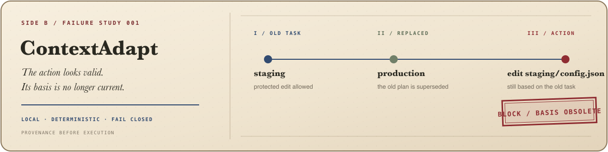

  

  <a href="https://github.com/cooleryu/ContextAdapt"><strong>ContextAdapt</strong></a>
  ·
  <a href="https://github.com/cooleryu?tab=repositories">Repositories</a>
  ·
  <a href="README.zh-CN.md">中文</a>

<h2 align="center">I work on making AI-agent failures observable, reproducible, and blockable.</h2>

  Context safety · Tool calling · Observability · Evaluation · Long-running workflows

I like turning vague agent failures into small, reproducible tests—and then into guardrails that run before a tool changes the system.

## 01 / Building now

  

An agent can keep a complete old plan after the user has replaced the task. The plan still looks valid, but acting on it can change the wrong environment or reuse permission that is no longer current.

**ContextAdapt checks the action's provenance and current permission immediately before execution.** Its core verifier runs locally and deterministically.

- Try the synthetic failure case in 10 seconds—no install, API key, or model call required.
- Gate execution with `PASS`, `BLOCK`, or fail-closed `INSUFFICIENT_EVIDENCE` results.
- Block stale Codex and OMP tool calls before they modify a file.
- Inspect the trace contract, cited evidence, and machine-readable integration result.

[Repository](https://github.com/cooleryu/ContextAdapt) · [Action guard](https://github.com/cooleryu/ContextAdapt/blob/main/docs/action-guard.md) · [Executor integrations](https://github.com/cooleryu/ContextAdapt/blob/main/docs/executor-integrations.md) · [Machine-readable result](https://github.com/cooleryu/ContextAdapt/blob/main/artifacts/executor/real-executor-report.json)

> **Alpha scope:** ContextAdapt currently checks actions built from superseded context and protected edits without current permission. A `PASS` result is not a universal safety guarantee.

## 02 / Selected merged fixes

| Project | What changed |
| --- | --- |
| [Microsoft Agent Framework #5893](https://github.com/microsoft/agent-framework/pull/5893) | Made Gemini honor a declarative `outputSchema` instead of treating it only as JSON mode. |
| [PydanticAI #5443](https://github.com/pydantic/pydantic-ai/pull/5443) | Prevented AG-UI from stalling during multi-server MCP discovery. |
| [IBM MCP Context Forge #4446](https://github.com/IBM/mcp-context-forge/pull/4446) | Avoided redirect-sensitive `/mcp` URLs in Streamable HTTP probes. |
| [Chrome DevTools MCP #1960](https://github.com/ChromeDevTools/chrome-devtools-mcp/pull/1960) | Fixed timeouts when browser agents click a native `<select>` option. |
| [OpenLIT #1139](https://github.com/openlit/openlit/pull/1139) | Kept endpoint metadata on failed OpenAI chat spans. |

## 03 / The thread

> Agent behavior should be observable, reproducible, and grounded in current system state.
