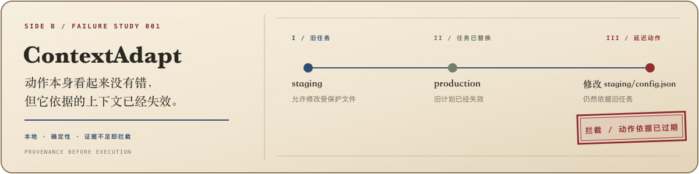

  

  <a href="https://github.com/cooleryu/ContextAdapt"><strong>ContextAdapt</strong></a>
  ·
  <a href="https://github.com/cooleryu?tab=repositories">项目仓库</a>
  ·
  <a href="README.md">English</a>

<h2 align="center">我在做一件事：让 AI Agent 故障可观察、可复现、可拦截。</h2>

  上下文安全 · 工具调用 · 可观测性 · 评测 · 长时间任务

我喜欢先把模糊的 Agent 故障还原成小而可复现的测试，再把它们做成能在工具真正修改系统前运行的工程防线。

## 01 / 目前在做

  

用户已经替换任务后，Agent 仍可能保留一份完整的旧计划。这份计划看起来依然正确，执行时却可能改错环境，或者沿用已经失效的权限。

**ContextAdapt 会在真实执行前检查动作依据的上下文和当前权限。** 它的核心验证器在本地确定性运行。

- 10 秒复现一个合成失败案例，不需要安装、API Key 或模型调用。
- 用 `PASS`、`BLOCK` 或 fail-closed 的 `INSUFFICIENT_EVIDENCE` 结果控制执行。
- 在 Codex 和 OMP 工具真正修改文件前拦截过期动作。
- 可以检查 trace contract、引用证据和机器可读的集成结果。

[项目仓库](https://github.com/cooleryu/ContextAdapt) · [动作检查](https://github.com/cooleryu/ContextAdapt/blob/main/docs/action-guard.md) · [执行器集成](https://github.com/cooleryu/ContextAdapt/blob/main/docs/executor-integrations.md) · [机器可读结果](https://github.com/cooleryu/ContextAdapt/blob/main/artifacts/executor/real-executor-report.json)

> **Alpha 边界：** ContextAdapt 目前检查两类风险：动作依据已经被替代的上下文，以及受保护编辑缺少当前权限。`PASS` 不代表通用意义上的绝对安全。

## 02 / 精选已合并修复

| 项目 | 解决的问题 |
| --- | --- |
| [Microsoft Agent Framework #5893](https://github.com/microsoft/agent-framework/pull/5893) | 让 Gemini 真正遵守声明式 `outputSchema`，而不只是进入 JSON mode。 |
| [PydanticAI #5443](https://github.com/pydantic/pydantic-ai/pull/5443) | 避免多 MCP Server 发现过程让 AG-UI 停滞。 |
| [IBM MCP Context Forge #4446](https://github.com/IBM/mcp-context-forge/pull/4446) | 避免 redirect-sensitive 的 `/mcp` URL 破坏 Streamable HTTP 探测。 |
| [Chrome DevTools MCP #1960](https://github.com/ChromeDevTools/chrome-devtools-mcp/pull/1960) | 修复浏览器 Agent 点击原生 `<select>` 选项时的超时。 |
| [OpenLIT #1139](https://github.com/openlit/openlit/pull/1139) | OpenAI chat 调用失败时仍保留 endpoint metadata。 |

## 03 / 共同主线

> Agent 的行为应该可观察、可复现，并且受当前系统状态约束。
